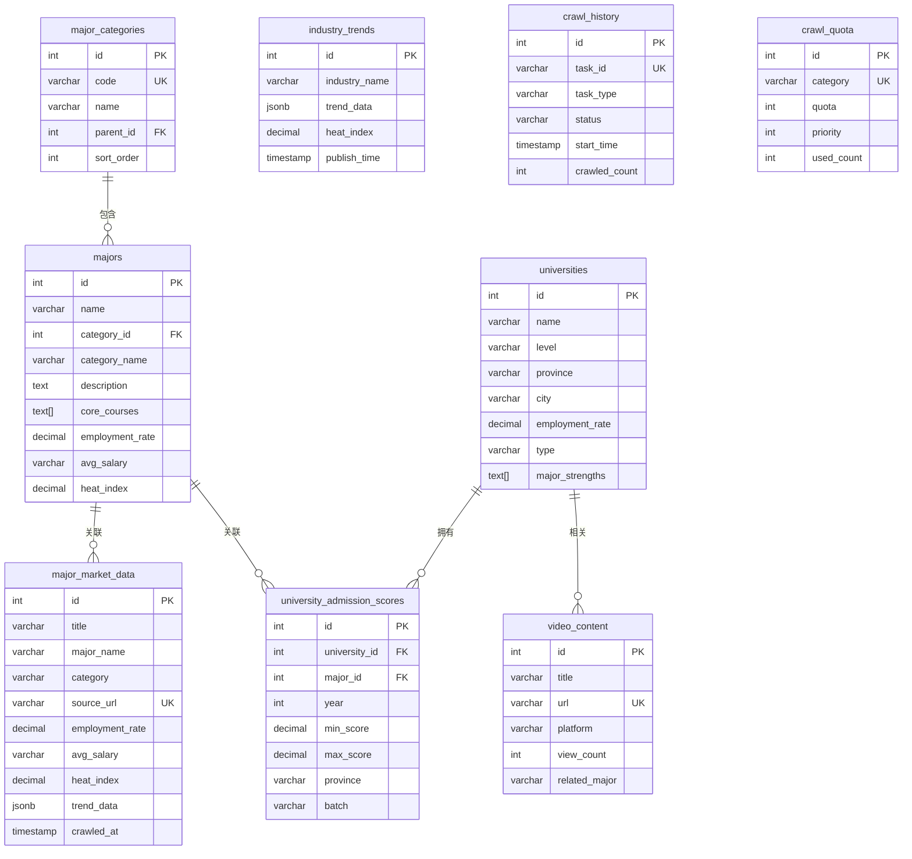

# 爬虫数据分析与数据模型设计

## 一、项目概述

### 1.1 项目简介

本项目是一款智能专业选择指导应用，旨在通过AI语音助手为高中生及其家长提供个性化的专业选择指导服务。应用支持多端访问（Web、iOS、Android、小程序），用户可以通过语音与智能助手进行自然交流，获取专业信息、学科趋势分析、院校推荐等信息。

### 1.2 数据爬取目标

系统需要从多个权威网站爬取教育相关数据，为学生提供准确、及时的专业选择参考。主要数据来源包括：

- **阳光高考**（https://gaokao.chsi.com.cn）：专业信息、院校信息、录取分数线
- **中国教育在线**（https://www.eol.cn）：专业介绍、分数线、就业数据
- **高考志愿填报平台**：专业排名、就业数据
- **各高校官网**：招生简章、专业设置、录取数据
- **B站/YouTube**：专业介绍视频
- **知乎/小红书**：经验分享和评价

---

## 二、需要爬取数据的模块分析

### 2.1 模块总览

| 序号 | 模块名称 | 数据类型 | 数据来源 | 更新频率 | 数据量级 | 优先级 |
|-----|---------|---------|---------|---------|---------|-------|
| 1 | 专业行情数据 | 就业率、薪资、热度 | 阳光高考、中国教育在线 | 每3天 | 约10,000条 | P0 |
| 2 | 录取分数线 | 最低/最高分、平均分 | 阳光高考、各高校官网 | 每年 | 约50,000条 | P0 |
| 3 | 大学信息 | 基本信息、王牌专业 | 教育部、各高校官网 | 每年 | 约3,000所 | P0 |
| 4 | 专业信息 | 名称、学科、课程 | 阳光高考、中国教育在线 | 每3天 | 约800个 | P0 |
| 5 | 行业趋势 | 发展动态、政策变化 | 知乎、B站、新闻网站 | 每日 | 约5,000条 | P1 |
| 6 | 视频内容 | 标题、播放量、时长 | B站、YouTube API | 实时 | 按需 | P1 |
| 7 | 学科分类 | 12个学科门类 | 教育部标准 | 很少 | 约100条 | P2 |
| 8 | 爬取历史 | 任务记录、状态 | 系统内部 | 每次爬取 | 约500条 | P2 |

### 2.2 模块详细分析

#### 2.2.1 专业行情数据模块

**描述**：爬取各专业的就业率、平均薪资、热度指数、发展趋势等行情数据。

**数据类型**：
- 专业名称（major_name）
- 学科门类（category）
- 就业率（employment_rate）
- 平均薪资（avg_salary）
- 热度指数（heat_index）
- 发展趋势（trend_data）
- 核心课程（courses）
- 就业前景（career_prospects）
- 数据来源URL（source_url）
- 爬取时间（crawled_at）

**数据来源**：
- 阳光高考：https://gaokao.chsi.com.cn
- 中国教育在线：https://www.eol.cn

**更新频率**：每3天自动爬取

**学科配额规则**：
| 学科类别 | 配额 | 优先级 |
|---------|------|-------|
| 工学 | 100条 | 10（最高） |
| 理学 | 80条 | 9 |
| 经济学 | 80条 | 9 |
| 管理学 | 70条 | 8 |
| 医学 | 60条 | 7 |
| 法学 | 60条 | 7 |
| 文学 | 50条 | 6 |
| 教育学 | 50条 | 6 |
| 艺术学 | 40条 | 5 |
| 哲学 | 30条 | 4 |
| 历史学 | 30条 | 4 |
| 农学 | 30条 | 4 |
| 军事学 | 20条 | 3（最低） |

**数据库最大存储**：10,000条（自动清理旧数据）

---

#### 2.2.2 录取分数线模块

**描述**：爬取各高校各专业的录取分数线，包括最低分、最高分、平均分、录取人数等。

**数据类型**：
- 大学名称（university_name）
- 专业名称（major_name）
- 年份（year）
- 最低录取分（min_score）
- 最高录取分（max_score）
- 平均录取分（avg_score）
- 招生省份（province）
- 录取批次（batch）
- 录取人数（enrollment_count）

**数据来源**：
- 阳光高考：https://gaokao.chsi.com.cn
- 各高校官网招生页面

**更新频率**：每年高考后更新（约6-7月）

**数据量级**：约50,000条（覆盖3,000所大学 × 约17个专业类别）

---

#### 2.2.3 大学信息模块

**描述**：爬取和存储各高校的基本信息。

**数据类型**：
- 大学名称（name）
- 985/211/双一流标签（level）
- 所在省份（province）
- 所在城市（city）
- 大学类型（type）：综合/理工/师范/医药/农林/财经/政法/语言/艺术
- 就业率（employment_rate）
- 建校年份（founded_year）
- 官网地址（website）
- 王牌专业（major_strengths）：数组类型
- 详细地址（location）

**数据来源**：
- 教育部公开数据
- 各高校官网

**更新频率**：每年更新

**数据量级**：约3,000所普通高等学校

---

#### 2.2.4 专业信息模块

**描述**：爬取和存储各专业的基本信息，包括学科分类、核心课程等。

**数据类型**：
- 专业名称（name）
- 学科门类ID（category_id）
- 学科门类名称（category_name）
- 专业描述（description）
- 核心课程（core_courses）：数组类型
- 就业率（employment_rate）
- 平均薪资（avg_salary）
- 热度指数（heat_index）

**数据来源**：
- 阳光高考专业库
- 中国教育在线专业介绍

**更新频率**：每3天

**数据量级**：约800个本科专业

---

#### 2.2.5 行业趋势数据模块

**描述**：爬取行业发展动态、政策变化、薪资变化趋势等数据。

**数据类型**：
- 行业名称（industry_name）
- 发展趋势（trend）
- 政策变化（policy_change）
- 薪资变化（salary_change）
- 数据来源（source）
- 发布时间（publish_time）
- 热度指数（heat_index）

**数据来源**：
- 知乎专栏
- B站相关视频
- 腾讯新闻
- 麦可思就业质量报告

**更新频率**：每日

**数据量级**：约5,000条

---

#### 2.2.6 视频内容数据模块

**描述**：存储从B站、YouTube等平台搜索到的专业介绍视频信息。

**数据类型**：
- 视频标题（title）
- 视频描述（description）
- 视频URL（url）
- 封面图（cover）
- 视频时长（duration）
- 播放量（view_count）
- 发布时间（publish_time）
- 作者（author）
- 相关专业（related_major）

**数据来源**：
- B站搜索API
- YouTube Data API

**更新频率**：实时按需

**数据量级**：按需爬取

---

#### 2.2.7 学科分类模块

**描述**：存储12个学科门类及其子分类。

**数据类型**：
- 学科名称（name）
- 学科代码（code）
- 父级ID（parent_id）
- 排序（sort_order）

**数据来源**：
- 教育部《普通高等学校本科专业目录》

**更新频率**：很少更新

**数据量级**：约100条（12个一级学科 + 子分类）

---

#### 2.2.8 爬取历史记录模块

**描述**：记录每次爬取任务的状态和结果。

**数据类型**：
- 任务ID（task_id）
- 任务类型（task_type）
- 开始时间（start_time）
- 结束时间（end_time）
- 状态（status）：pending/running/completed/failed
- 爬取数量（crawled_count）
- 成功数量（success_count）
- 失败数量（failed_count）
- 错误信息（error_message）

**数据来源**：系统内部生成

**更新频率**：每次爬取任务

**数据量级**：约500条（保留最近100次任务）

**数据保留策略**：
- 成功任务记录：保留30天
- 失败任务记录：保留30天
- 临时日志：保留7天

---

## 三、数据模型设计

### 3.1 数据库选型

| 数据类型 | 数据库 | 原因 |
|---------|--------|------|
| 核心业务数据 | PostgreSQL 15.x | 功能完整、可靠性高、JSON支持良好 |
| 缓存数据 | Redis 7.x | 高性能、会话管理、实时数据 |
| 搜索数据 | Elasticsearch 8.x | 全文检索、数据分析 |
| 向量数据 | Chroma | 知识库检索、相似度匹配 |

### 3.2 表结构设计

#### 3.2.1 学科分类表（major_categories）

```sql
CREATE TABLE major_categories (
    id SERIAL PRIMARY KEY,
    code VARCHAR(20) NOT NULL UNIQUE,      -- 学科代码，如"08"代表工学
    name VARCHAR(100) NOT NULL,             -- 学科名称，如"工学"
    parent_id INT,                          -- 父级ID，一级学科为NULL
    sort_order INT DEFAULT 0,               -- 排序
    created_at TIMESTAMP DEFAULT NOW(),
    updated_at TIMESTAMP DEFAULT NOW()
);

-- 创建索引
CREATE INDEX idx_major_categories_parent ON major_categories(parent_id);
CREATE INDEX idx_major_categories_code ON major_categories(code);

-- 外键约束
ALTER TABLE major_categories
    ADD CONSTRAINT fk_major_categories_parent
    FOREIGN KEY (parent_id) REFERENCES major_categories(id);
```

**说明**：存储12个一级学科门类及其子分类

---

#### 3.2.2 专业信息表（majors）

```sql
CREATE TABLE majors (
    id SERIAL PRIMARY KEY,
    name VARCHAR(200) NOT NULL,             -- 专业名称
    category_id INT NOT NULL,               -- 学科门类ID
    category_name VARCHAR(100),             -- 学科门类名称（冗余存储，便于查询）
    description TEXT,                       -- 专业描述
    core_courses TEXT[],                    -- 核心课程（PostgreSQL数组）
    employment_rate DECIMAL(5,2),           -- 就业率
    avg_salary VARCHAR(100),                -- 平均薪资，如"15K-20K/月"
    heat_index DECIMAL(5,2),                -- 热度指数
    created_at TIMESTAMP DEFAULT NOW(),
    updated_at TIMESTAMP DEFAULT NOW()
);

-- 创建索引
CREATE INDEX idx_majors_category ON majors(category_id);
CREATE INDEX idx_majors_name ON majors(name);
CREATE INDEX idx_majors_employment ON majors(employment_rate DESC);
CREATE INDEX idx_majors_heat ON majors(heat_index DESC);

-- 外键约束
ALTER TABLE majors
    ADD CONSTRAINT fk_majors_category
    FOREIGN KEY (category_id) REFERENCES major_categories(id);
```

**说明**：存储专业的基本信息，核心课程使用PostgreSQL数组类型

---

#### 3.2.3 专业行情数据表（major_market_data）

```sql
CREATE TABLE major_market_data (
    id SERIAL PRIMARY KEY,
    title VARCHAR(500) NOT NULL,            -- 数据标题
    major_name VARCHAR(200),                 -- 专业名称
    category VARCHAR(100),                   -- 学科门类
    source_url VARCHAR(1000) UNIQUE,        -- 来源URL（用于去重）
    source_website VARCHAR(100),            -- 来源网站
    employment_rate DECIMAL(5,2),           -- 就业率
    avg_salary VARCHAR(100),                -- 平均薪资
    admission_score DECIMAL(5,2),           -- 录取分数线
    heat_index DECIMAL(5,2),                -- 热度指数
    trend_data JSONB,                       -- 趋势数据（JSON格式）
    description TEXT,                       -- 详细描述
    courses JSONB,                          -- 核心课程（JSON数组）
    career_prospects TEXT,                  -- 就业前景
    crawled_at TIMESTAMP DEFAULT NOW(),     -- 爬取时间
    updated_at TIMESTAMP DEFAULT NOW(),     -- 更新时间
    created_at TIMESTAMP DEFAULT NOW()      -- 创建时间
);

-- 创建索引
CREATE INDEX idx_major_market_crawled ON major_market_data(crawled_at DESC);
CREATE INDEX idx_major_market_major_name ON major_market_data(major_name);
CREATE INDEX idx_major_market_category ON major_market_data(category);
CREATE INDEX idx_major_market_heat ON major_market_data(heat_index DESC);
CREATE INDEX idx_major_market_employment ON major_market_data(employment_rate DESC);

-- 部分索引：按学科门类+热度排序
CREATE INDEX idx_major_market_category_heat ON major_market_data(category, heat_index DESC);

-- 触发器：自动更新updated_at
CREATE TRIGGER update_major_market_data_updated
    BEFORE UPDATE ON major_market_data
    FOR EACH ROW
    EXECUTE FUNCTION update_updated_at_column();
```

**说明**：存储专业行情数据，包括就业率、薪资、热度等。使用JSONB存储灵活数据（趋势数据、课程等）

---

#### 3.2.4 大学信息表（universities）

```sql
CREATE TABLE universities (
    id SERIAL PRIMARY KEY,
    name VARCHAR(200) NOT NULL,             -- 大学名称
    level VARCHAR(50),                      -- 985/211/双一流/省属重点
    province VARCHAR(50) NOT NULL,          -- 所在省份
    city VARCHAR(50),                       -- 所在城市
    employment_rate DECIMAL(5,2),           -- 就业率
    type VARCHAR(50),                       -- 大学类型
    location TEXT,                          -- 详细地址
    founded_year INT,                       -- 建校年份
    website VARCHAR(500),                   -- 官网地址
    major_strengths TEXT[],                 -- 王牌专业（PostgreSQL数组）
    created_at TIMESTAMP DEFAULT NOW(),
    updated_at TIMESTAMP DEFAULT NOW()
);

-- 创建索引
CREATE INDEX idx_universities_province ON universities(province);
CREATE INDEX idx_universities_level ON universities(level);
CREATE INDEX idx_universities_employment ON universities(employment_rate DESC);
CREATE INDEX idx_universities_name ON universities(name);

-- 部分索引：按省份+就业率排序
CREATE INDEX idx_universities_province_emp ON universities(province, employment_rate DESC);
```

**说明**：存储大学基本信息，王牌专业使用PostgreSQL数组类型存储

---

#### 3.2.5 录取分数线表（university_admission_scores）

```sql
CREATE TABLE university_admission_scores (
    id SERIAL PRIMARY KEY,
    university_id INT NOT NULL,             -- 大学ID
    university_name VARCHAR(200),           -- 大学名称（冗余存储）
    major_id INT,                           -- 专业ID（可为NULL，表示不分专业的录取分）
    major_name VARCHAR(200),                -- 专业名称（冗余存储）
    year INT NOT NULL,                      -- 年份
    min_score DECIMAL(5,2) NOT NULL,        -- 最低录取分
    max_score DECIMAL(5,2),                 -- 最高录取分
    avg_score DECIMAL(5,2),                 -- 平均录取分
    province VARCHAR(50) NOT NULL,          -- 招生省份
    batch VARCHAR(50),                      -- 录取批次
    enrollment_count INT,                   -- 录取人数
    created_at TIMESTAMP DEFAULT NOW(),
    updated_at TIMESTAMP DEFAULT NOW()
);

-- 创建索引
CREATE INDEX idx_admission_university ON university_admission_scores(university_id);
CREATE INDEX idx_admission_major ON university_admission_scores(major_id);
CREATE INDEX idx_admission_year ON university_admission_scores(year);
CREATE INDEX idx_admission_province ON university_admission_scores(province);
CREATE INDEX idx_admission_score ON university_admission_scores(min_score);

-- 复合索引：按大学+年份+省份查询
CREATE INDEX idx_admission_uni_year_prov ON university_admission_scores(university_id, year, province);

-- 外键约束
ALTER TABLE university_admission_scores
    ADD CONSTRAINT fk_admission_university
    FOREIGN KEY (university_id) REFERENCES universities(id);

ALTER TABLE university_admission_scores
    ADD CONSTRAINT fk_admission_major
    FOREIGN KEY (major_id) REFERENCES majors(id);
```

**说明**：存储各大学各专业的录取分数线数据，支持按多种维度查询

---

#### 3.2.6 行业趋势数据表（industry_trends）

```sql
CREATE TABLE industry_trends (
    id SERIAL PRIMARY KEY,
    industry_name VARCHAR(200) NOT NULL,    -- 行业名称
    trend_data JSONB NOT NULL,              -- 趋势数据（JSON格式）
    policy_change TEXT,                     -- 政策变化
    salary_change VARCHAR(100),             -- 薪资变化
    source VARCHAR(200),                    -- 数据来源
    source_url VARCHAR(1000),               -- 原文链接
    publish_time TIMESTAMP,                 -- 发布时间
    heat_index DECIMAL(5,2),                -- 热度指数
    crawled_at TIMESTAMP DEFAULT NOW(),
    created_at TIMESTAMP DEFAULT NOW(),
    updated_at TIMESTAMP DEFAULT NOW()
);

-- 创建索引
CREATE INDEX idx_industry_trends_name ON industry_trends(industry_name);
CREATE INDEX idx_industry_trends_time ON industry_trends(publish_time DESC);
CREATE INDEX idx_industry_trends_heat ON industry_trends(heat_index DESC);

-- 全文检索索引
CREATE INDEX idx_industry_trends_gin ON industry_trends USING gin(to_tsvector('simple', industry_name || ' ' || COALESCE(policy_change, '')));
```

**说明**：存储行业发展趋势数据，使用JSONB存储灵活的趋势数据，支持全文检索

---

#### 3.2.7 视频内容表（video_content）

```sql
CREATE TABLE video_content (
    id SERIAL PRIMARY KEY,
    title VARCHAR(500) NOT NULL,            -- 视频标题
    description TEXT,                       -- 视频描述
    url VARCHAR(1000) NOT NULL UNIQUE,      -- 视频URL
    cover_url VARCHAR(1000),                -- 封面图URL
    duration INT,                           -- 视频时长（秒）
    view_count INT DEFAULT 0,               -- 播放量
    author VARCHAR(200),                    -- 作者
    publish_time TIMESTAMP,                 -- 发布时间
    platform VARCHAR(50) NOT NULL,          -- 平台：B站/YouTube
    related_major VARCHAR(200),             -- 相关专业
    keywords TEXT[],                        -- 关键词标签
    heat_index DECIMAL(5,2),                -- 热度指数
    crawled_at TIMESTAMP DEFAULT NOW(),
    created_at TIMESTAMP DEFAULT NOW(),
    updated_at TIMESTAMP DEFAULT NOW()
);

-- 创建索引
CREATE INDEX idx_video_platform ON video_content(platform);
CREATE INDEX idx_video_major ON video_content(related_major);
CREATE INDEX idx_video_view ON video_content(view_count DESC);
CREATE INDEX idx_video_heat ON video_content(heat_index DESC);
CREATE INDEX idx_video_publish ON video_content(publish_time DESC);

-- GIN索引：关键词搜索
CREATE INDEX idx_video_keywords ON video_content USING gin(keywords);
```

**说明**：存储从B站、YouTube等平台爬取的视频信息

---

#### 3.2.8 爬取历史表（crawl_history）

```sql
CREATE TABLE crawl_history (
    id SERIAL PRIMARY KEY,
    task_id VARCHAR(100) NOT NULL UNIQUE,   -- 任务ID
    task_type VARCHAR(50) NOT NULL,         -- 任务类型：major/university/video/trend
    start_time TIMESTAMP,                   -- 开始时间
    end_time TIMESTAMP,                     -- 结束时间
    status VARCHAR(20) NOT NULL,            -- 状态：pending/running/completed/failed
    crawled_count INT DEFAULT 0,            -- 爬取数量
    success_count INT DEFAULT 0,            -- 成功数量
    failed_count INT DEFAULT 0,             -- 失败数量
    error_message TEXT,                     -- 错误信息
    created_at TIMESTAMP DEFAULT NOW()
);

-- 创建索引
CREATE INDEX idx_crawl_history_type ON crawl_history(task_type);
CREATE INDEX idx_crawl_history_status ON crawl_history(status);
CREATE INDEX idx_crawl_history_time ON crawl_history(start_time DESC);

-- 部分索引：只索引最近的任务
CREATE INDEX idx_crawl_history_recent ON crawl_history(start_time DESC)
    WHERE start_time > NOW() - INTERVAL '30 days';
```

**说明**：记录爬取任务的历史，支持任务监控和问题排查

---

#### 3.2.9 爬取配额表（crawl_quota）

```sql
CREATE TABLE crawl_quota (
    id SERIAL PRIMARY KEY,
    category VARCHAR(100) NOT NULL UNIQUE,  -- 学科类别
    quota INT NOT NULL,                      -- 配额数量
    priority INT NOT NULL,                   -- 优先级（数字越大优先级越高）
    used_count INT DEFAULT 0,                -- 已使用数量
    last_reset_time TIMESTAMP,               -- 上次重置时间
    updated_at TIMESTAMP DEFAULT NOW()
);

-- 创建索引
CREATE INDEX idx_crawl_quota_priority ON crawl_quota(priority DESC);
```

**说明**：管理各学科的爬取配额，确保热门学科数据充足

---

### 3.3 ER关系图



---

## 四、数据字典

### 4.1 公共字段说明

| 字段名 | 类型 | 说明 |
|-------|------|------|
| id | SERIAL | 主键，自增 |
| created_at | TIMESTAMP | 创建时间，默认为当前时间 |
| updated_at | TIMESTAMP | 更新时间，默认为当前时间 |
| crawled_at | TIMESTAMP | 爬取时间，用于记录数据采集时间 |

### 4.2 枚举值说明

**大学 level 枚举值**：
- `985`：985工程高校
- `211`：211工程高校
- `双一流`：双一流建设高校
- `省属重点`：省属重点高校
- `普通`：普通本科院校

**大学 type 枚举值**：
- `综合`：综合性大学
- `理工`：理工类大学
- `师范`：师范类大学
- `医药`：医药类大学
- `农林`：农林类大学
- `财经`：财经类大学
- `政法`：政法类大学
- `语言`：语言类大学
- `艺术`：艺术类大学
- `体育`：体育类大学
- `民族`：民族类大学

**录取批次 batch 枚举值**：
- `本科一批`：本科第一批次录取
- `本科二批`：本科第二批次录取
- `本科提前批`：本科提前批次录取
- `专科批`：专科批次录取

**爬取任务状态 status 枚举值**：
- `pending`：等待执行
- `running`：执行中
- `completed`：成功完成
- `failed`：执行失败
- `partially_completed`：部分完成

---

## 五、索引策略总结

### 5.1 查询场景与索引对应

| 查询场景 | 涉及表 | 索引 |
|---------|-------|------|
| 按专业名称查询行情 | major_market_data | idx_major_market_major_name |
| 按学科门类筛选 | major_market_data | idx_major_market_category |
| 按热度排序 | major_market_data | idx_major_market_heat |
| 按省份查询大学 | universities | idx_universities_province |
| 按录取分数查询 | university_admission_scores | idx_admission_score |
| 按时间查询爬取历史 | crawl_history | idx_crawl_history_time |

### 5.2 复合索引设计

| 复合索引 | 表 | 适用场景 |
|---------|-----|---------|
| (category, heat_index DESC) | major_market_data | 按学科门类+热度筛选排序 |
| (province, employment_rate DESC) | universities | 按省份+就业率筛选排序 |
| (university_id, year, province) | university_admission_scores | 按大学+年份+省份查询分数 |
| (start_time DESC) | crawl_history | 按时间倒序查询任务历史 |

---

## 六、数据来源与更新策略

### 6.1 数据来源清单

| 数据类型 | 主要来源 | 备用来源 | 更新频率 |
|---------|---------|---------|---------|
| 专业行情 | 阳光高考 | 中国教育在线 | 每3天 |
| 录取分数 | 阳光高考 | 各高校官网 | 每年6-7月 |
| 大学信息 | 教育部公开数据 | 各高校官网 | 每年 |
| 行业趋势 | 麦可思报告 | 知乎、B站 | 每日 |
| 视频内容 | B站 API | YouTube API | 实时 |

### 6.2 爬取策略

**自动爬取调度**：
- 专业行情：每3天凌晨2:00执行
- 录取分数：每年高考成绩公布后立即执行
- 大学信息：每年9月开学季执行
- 行业趋势：每日凌晨3:00执行
- 视频内容：用户查询时实时触发

**数据去重策略**：
- 基于 source_url 字段去重
- 基于 title + source_url 组合去重

**数据保留策略**：
- 专业行情数据：最多10,000条，保留最新的
- 录取分数数据：保留近5年
- 爬取历史：保留30天
- 失败记录：保留30天

---

## 七、后续建议

### 7.1 扩展方向

1. **数据质量监控**
   - 增加数据校验规则
   - 添加数据异常告警
   - 建立数据质量评分体系

2. **性能优化**
   - 对高频查询添加更多索引
   - 使用分区表存储历史数据
   - 引入Redis缓存热点数据

3. **搜索增强**
   - 引入Elasticsearch支持全文检索
   - 实现相似专业推荐
   - 增加多维度排序功能

### 7.2 监控指标

| 指标 | 阈值 | 说明 |
|-----|------|------|
| 爬取成功率 | > 95% | 成功爬取数量/总爬取数量 |
| 数据新鲜度 | < 7天 | 数据最近更新时间 |
| 查询响应时间 | < 500ms | P99响应时间 |
| 存储使用率 | < 80% | 已使用存储/总存储 |

---

## 八、版本信息

| 版本 | 日期 | 说明 |
|-----|------|------|
| 1.0.0 | 2026-01-23 | 初始版本 |

---

**文档生成时间**：2026-01-23
**文档版本**：1.0.0
